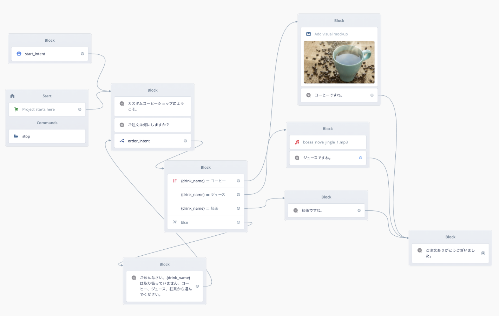

# voiceflow-line

# ** このレポジトリはアーカイブされています / This repository has been archived **

**Dialog Management APIができたので、Voiceflow SDKはobsoletedとなったそうです。本レポジトリのコードは動かない可能性がありますのでアーカイブしました。（Dialog Management APIにあわせた新しいSDKがそのうちリリースされるらしいです。）**

**Dialog Management APIを使ったLINE連携のデモはこちらをご覧ください。**

https://github.com/kun432/voiceflow-dialog-management-api-sample-ja/tree/main/express-line

-----

**This repository has been archived because Voiceflow SDK has been replaced with Dialog Management API and obsoleted now. These codes may not work. (I heard that a New SDK suitable for Dialog Management API will be released in future.) **

**New demo with Dialog Management API and LINE is here:**

https://github.com/kun432/voiceflow-dialog-management-api-sample-ja/tree/main/express-line

## About

Voiceflow SDKを使った、LINE BOTのサンプルです。

demo for node.js/express server for running a LINE chatbot with Voiceflow SDK.




## Usage

```
git clone https://github.com/kun432/voiceflow-line.git
cd voiceflow-line
npm install
```

LINE Developerコンソール上でMessaging APIの設定を行い、チャネルアクセストークンとチャネルシークレットを取得、環境変数で設定

```
export CHANNEL_ACCESS_TOKEN="XXXXX...XXXXX"
export CHANNEL_SECRET="XXXXX...XXXXX"
export PORT=1234
```

coffeeshop.vfをVoiceflowでインポートし、Voiceflow SDK用のバージョンIDとAPIキーを取得、これも環境変数で設定しておく

```
export VF_VERSION_ID="XXXXX...XXXXX"
export VF_API_KEY="VF.XXXXX...XXXXX"
```

ローカルでアプリとngrokを起動

```
node .
ngrok http 1234
```

ngrokで生成されたURL + "/callback" をLINE Messaging APIのWebhookに指定すればOK
